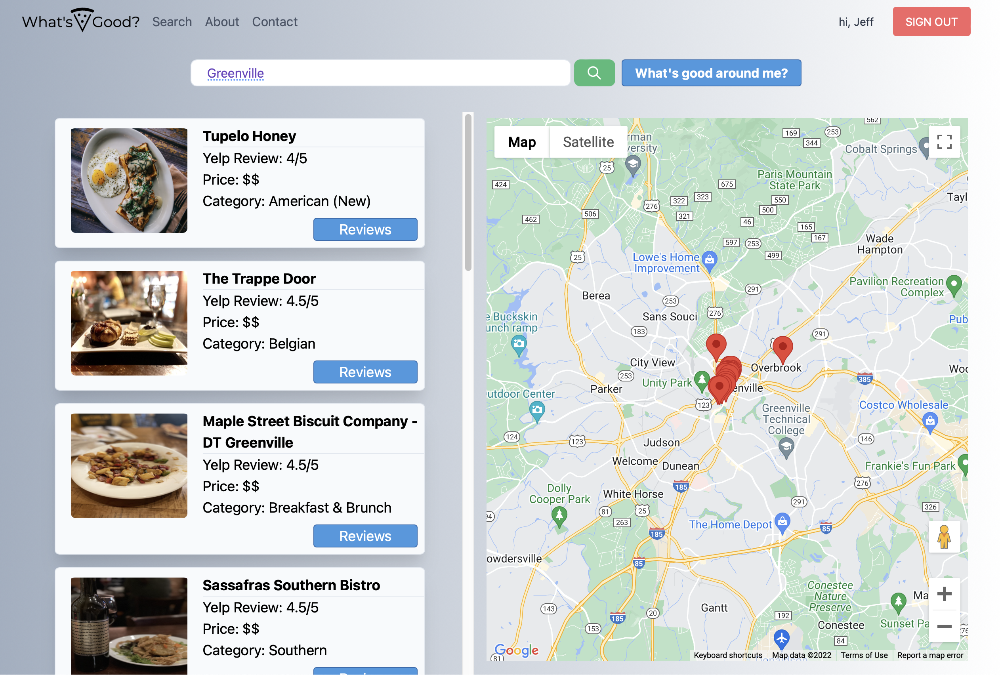
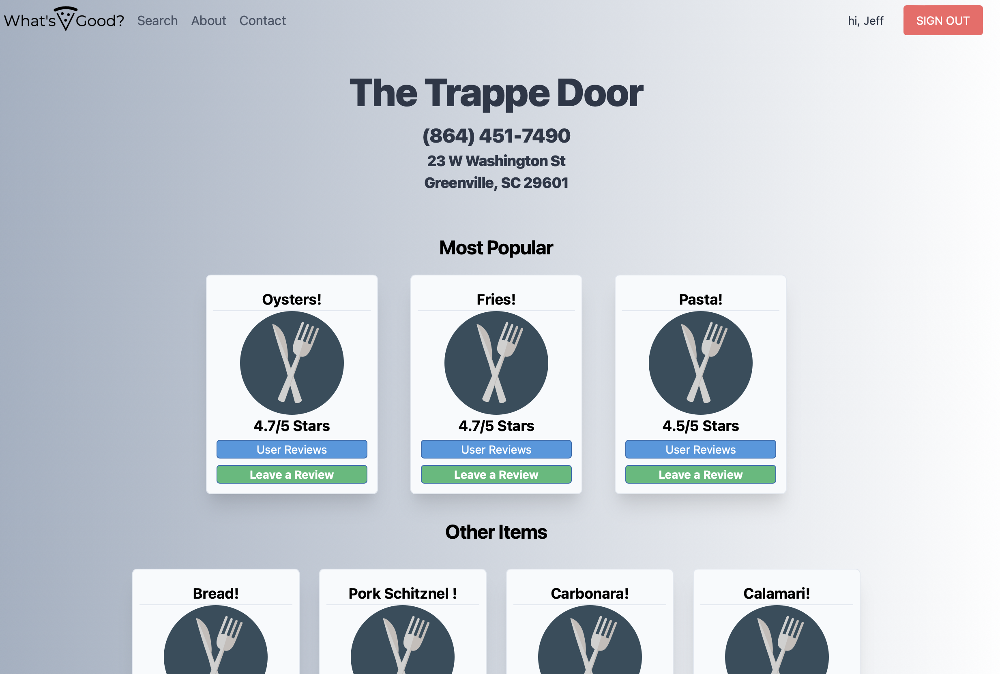

# Overview
- [About the Project](#about-the-project)
- [Features](#features)
- [Videos & Screenshots](#videos-and-screenshots)
- [Built With](#built-with)
- [Acknowledgments](#acknowledgments)
- [Authors](#authors)
## About The Project
What's Good is an application, built with React & MongoDB, that allows users to find the best dishes at every restraurant. 
## Features
- Secure user login, with passport JS, Google oauth 
- Search by city, location to pull up restaurants via Google Maps, Yelp API
- Create reviews of your favorite items, which are stored in MongoDB

## Videos & Screenshots
   

## Built With 
* React
* MongoDB
* NodeJS
* Express
* Passport.js 
* Oauth
* Google Maps API 
* Yelp API 

## Acknowledgements
- [Google Maps Platform](https://developers.google.com/maps)
- [Yelp API](https://www.yelp.com/developers/)

## Authors
- **Jeff L** - [jlam3950](https://github.com/jlam3950)
- **Seth R** - [sethreyes](https://github.com/SethReyes)

